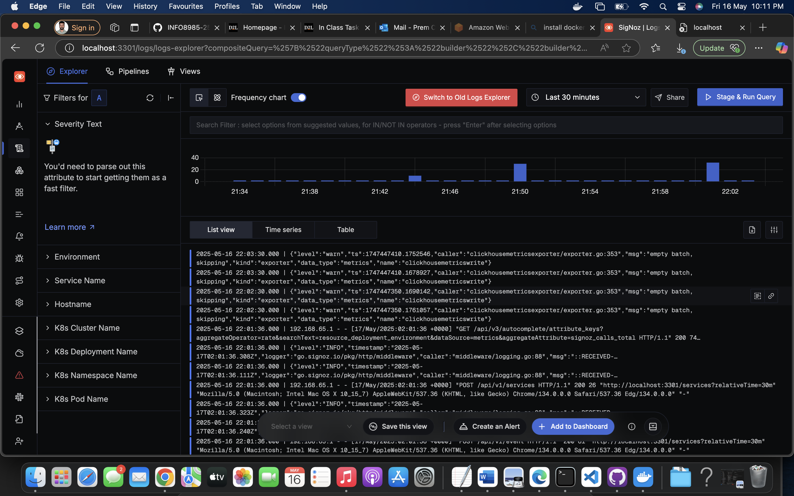

Hypothesis 1

signoz - feature-hypothesis-otel-config

Signoz demo with docker-compose - 

Prerequisites:
Docker

Docker Compose

Ansible

Signoz setup (already available in the repo)

Setup Steps:
Start Signoz Demo using Docker Compose:
You can start Signoz and all its components (like Clickhouse, OpenTelemetry Collector, etc.) with the following command:

ansible-playbook up.yml
This will set up the environment and bring up Signoz in a Docker Compose configuration in a Codespace (or local setup).

Stop Signoz Demo:
If you want to stop and tear down the demo setup, you can use:

bash
Copy
Edit
ansible-playbook down.yml
This will stop and remove the containers started with up.yml, especially focusing on clickhouse-setup/docker-compose-minimal.yaml and cleaning up resources.

Feature Branch: feature-hypothesis-otel-config
This branch contains the work related to Hypothesis 1 testing the otel-collector configuration for logs and metrics collection.

Hypothesis 1: otel-collector Configuration for Log and Metric Collection
Hypothesis:
We hypothesize that the otel-collector configuration might not be correctly set up to collect logs and metrics from the running Docker containers, leading to data not being displayed in Signoz.

Test Steps for Hypothesis 1:
Examine otel-collector Configuration:

The otel-collector-config.yaml file contains the configuration for the otel-collector, which is responsible for collecting logs and metrics from the Docker containers. We checked that the relevant receivers (tcplog/docker for logs and otlp for metrics) are properly configured.

Verify Collector is Running:

We ensured that the otel-collector container is up and running by executing:

docker ps
The container signoz-otel-collector was running as expected.

Check Logs of the Collector:

The otel-collector logs were examined to ensure no errors occurred during log and metric processing. The command used to view logs was:

docker logs signoz-otel-collector
Check Logs and Metrics in Signoz UI:

After confirming the otel-collector is working, we logged into the Signoz UI at http://localhost:3301.

We checked if logs were being displayed under the Logs section and metrics were visible in the Metrics section.

Validate with Load Generation (Optional):

We simulated some load using Locust to generate traffic, and checked whether logs were displayed in real-time. The following command was used to start Locust:

locust -f locust-scripts/locustfile.py
Health Check:

To ensure everything is working, we accessed the health check endpoint:

http://localhost:13133/health
Results:
Logs and metrics were successfully collected and displayed in Signoz.

The otel-collector was correctly configured, and no errors were found in its logs.

No issues were identified in the otel-collector configuration for data collection.

Screenshots:

Hypothesis:
There might be a misconfiguration in the otel-collector-config.yaml that prevents Signoz from collecting logs and metrics.

Actions Taken:

Reviewed and confirmed that the receivers, processors, and exporters for logs and metrics are properly configured in otel-collector-config.yaml.

Confirmed signoz-otel-collector is running (docker ps).

Checked collector logs (docker logs signoz-otel-collector) — no major errors found.

Logged in to Signoz at http://localhost:3301 and confirmed logs and metrics are showing up.

Validated the health check endpoint (http://localhost:13133/health) — collector is healthy.
